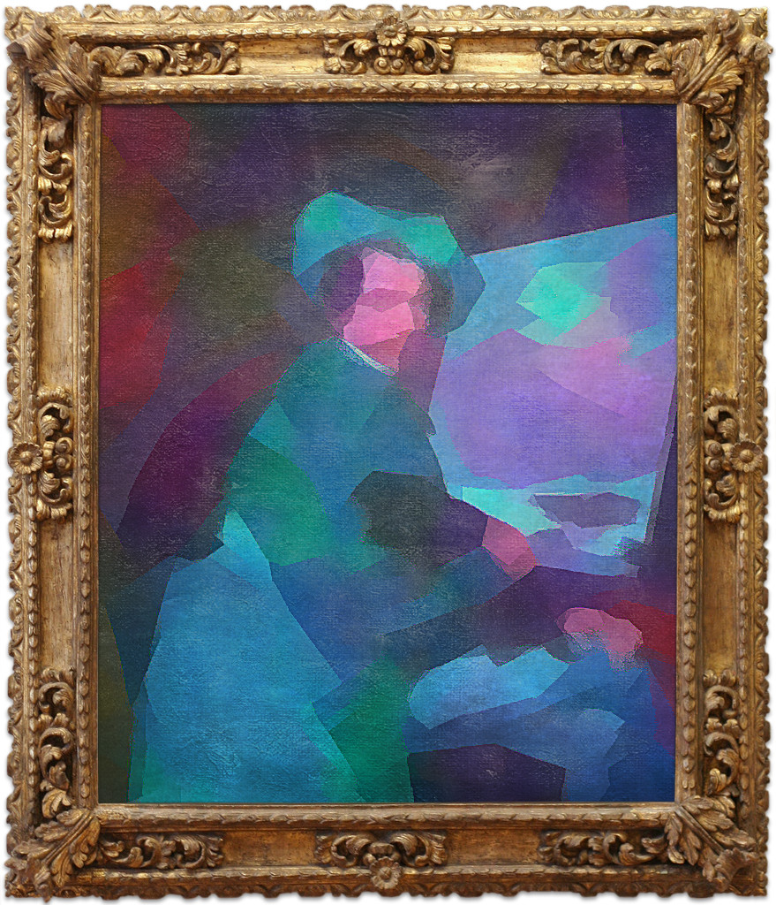

# :brain::man_artist::robot: **Neural Painter Bot** 

    

## :brain::man_artist: [Neural Painter](https://t.me/NeuralPainterBot) is a Telegram Bot that implements neural network solutions to the task of Fast Style Transfer :zap:

## :robot: The Bot supports two modes:

 ### :rainbow: Stylization mode (MSG-Net)

    

 ### :art: Painting mode (CycleGAN)

    

## TODO:

- [ ] Add more painting styles

- [ ] Substitute threading.Thread on concurrent.futures.ProcessPool

- [ ] Refactor style menu code using OOP patterns, such as a factory

- [ ] Refactor pre-trained CycleGAN model (remove `./models` subfolder)

## :bow: *Acknowledgements*:

- ### *Multi-style Generative Network for Real-time Transfer (Zhang & Dana, 2017)*
    - ### *[arXiv paper](https://arxiv.org/pdf/1703.06953.pdf) & [GitHub repository](https://github.com/zhanghang1989/PyTorch-Multi-Style-Transfer)*

- ### *Unpaired Image-to-Image Translation using Cycle-Consistent Adversarial Networks (Zhu et al., 2017)*
    - ### *[arXiv paper](https://arxiv.org/pdf/1703.10593.pdf) & [GitHub repository](https://github.com/junyanz/pytorch-CycleGAN-and-pix2pix)*
